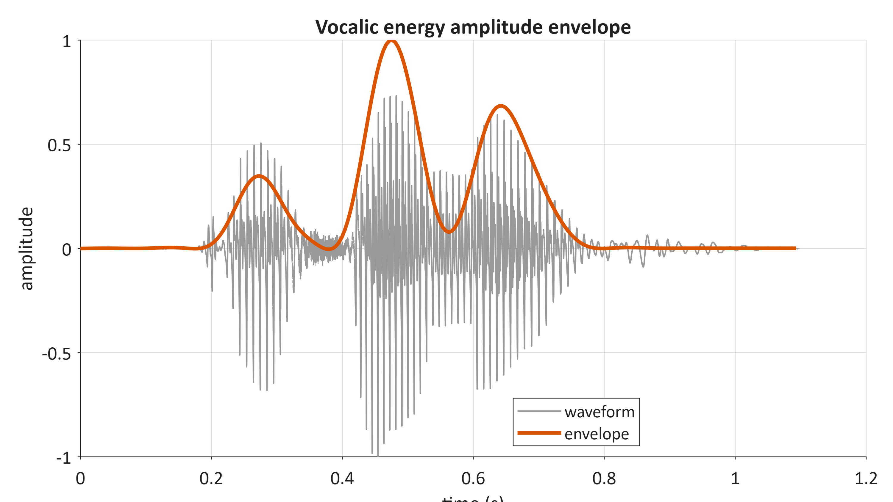
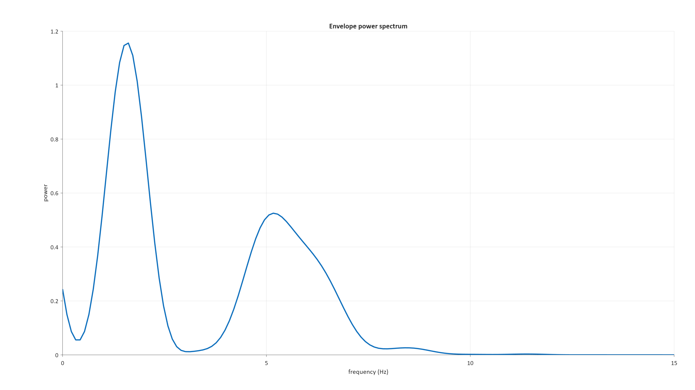
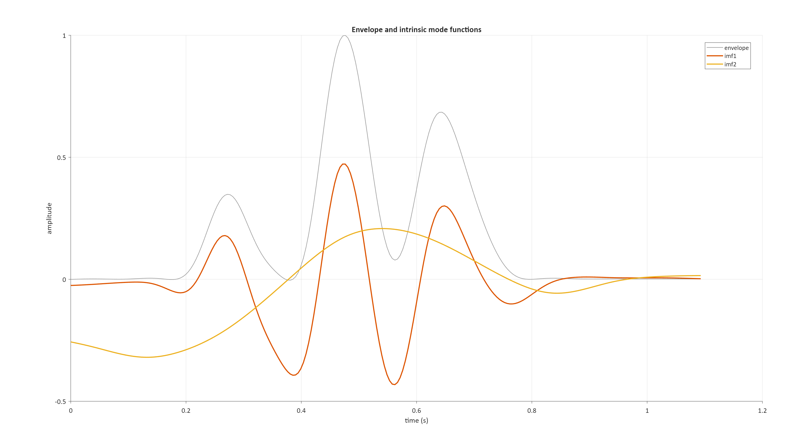
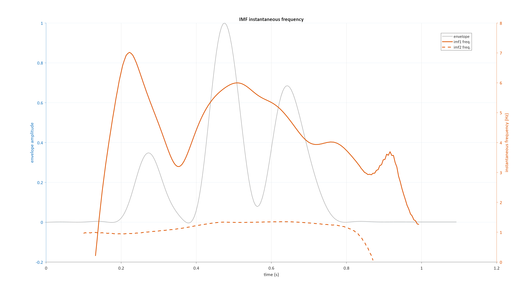

# EnvelopeMetrics

MATLAB code for quantifying the rhythm of speech via its amplitude envelope: Low
Frequency Fourier Analysis (LFFA) of the envelope's power spectrum (Tilsen & Johnson,
2008), and Empirical Mode Decomposition (EMD) / Hilbert-Huang analysis of its intrinsic
oscillatory components (Tilsen & Arvaniti, 2013). For a mathematical description, see
[TECHNICAL.md](TECHNICAL.md).

**References**

- Tilsen, S., & Johnson, K. (2008). Low-frequency Fourier analysis of speech rhythm.
  *The Journal of the Acoustical Society of America*, 124(2), EL34–EL39.
  https://doi.org/10.1121/1.2947626
- Tilsen, S., & Arvaniti, A. (2013). Speech rhythm analysis with decomposition of the
  amplitude envelope: Characterizing rhythmic patterns within and across languages.
  *The Journal of the Acoustical Society of America*, 134(1), 628–639.
  https://doi.org/10.1121/1.4807565

If you use this code, please cite the paper(s) above describing the method(s) you used.
To cite this repository itself, see [CITATION.cff](CITATION.cff) (recognized by GitHub's
"Cite this repository" button).

## Requirements

- MATLAB with the **Signal Processing Toolbox** (`butter`, `filtfilt`, `emd`, `hht`) and
  the **Statistics and Machine Learning Toolbox** (`nanmean`/`nanvar`/`nanstd`,
  `prctile`).

## Quick start

In a typical workflow, you would make a table of audio file paths and 
start/end times of tokens as below:

```matlab
% load tokens table:
T = readtable("./data/exampleTokensTable.csv");
head(T)
```
```
             file               t0     t1 
    _______________________    ____    ___

    {'./data/example1.wav'}    0.15    0.8
    {'./data/example2.wav'}     NaN    NaN
```

Columns `t0` and `t1` of the table indicate the start and end times of the token. These are optional,
and when they are not specified, they default to the start and end times of
audio file. An optional `channel` column selects which audio channel to read (1-based;
defaults to 1). Files that don't exist, or whose requested channel doesn't exist, are
skipped with a warning.

Then instantiate an object of the `envelopeMetrics` class with the table as input,
 and calculate the metrics:
```matlab
em = envelopeMetrics(T);
metrics = em.getMetrics();
```
```
             file               t0     t1     channel     Fs                                                                                         envelope                                                                                        sbpr_1     scntr_1    imf_ratio21    imf_ratio32    mu_w1     mu_w2     mu_w3     pow_imf1    pow_imf2    pow_imf3     sd_w1     sd_w2      sd_w3     sumpow_imf1    sumpow_imf2    sumpow_imf3    var_w1      var_w2     var_w3 
    _______________________    ____    ___    _______    _____    _______________________________________________________________________________________________________________________________________________________________________________    _______    _______    ___________    ___________    ______    ______    ______    ________    ________    ________    _______    ______    _______    ___________    ___________    ___________    _______    ________    _______

    {'./data/example1.wav'}    0.15    0.8       1       22050    {[ 0.0024 0.0017 9.2233e-04 3.7123e-05 -7.6058e-04 -0.0013 -0.0012 -1.7040e-04 0.0021 0.0061 0.0122 0.0207 0.0322 0.0467 0.0646 0.0856 0.1097 0.1363 0.1648  ] (1144 double)}    0.38793    4.7854       0.96428            NaN      4.9163    1.3269       NaN     37.575      36.233         NaN     0.87669    0.2511        NaN      24.539         23.662            NaN       0.76858    0.063053        NaN
    {'./data/example2.wav'}     NaN    NaN       1       22050    {[0.0076 0.0073 0.0086 0.0124 0.0195 0.0308 0.0471 0.0692 0.0977 0.1330 0.1752 0.2241 0.2792 0.3397 0.4046 0.4724 0.5418 0.6111 0.6787 0.7431 0.8027 0.8561  ] (1459 double)}     1.1868     3.717       0.84626        0.78364      5.0478    2.1908    1.1189     19.229      16.272      12.752      2.6619    0.9782    0.35159      40.027         33.873         26.544        7.0857     0.95687    0.12362
```

`getMetrics()` returns the input table itself (retaining `file`, `t0`, `t1`, `channel`), with
an added `Fs` column, each token's envelope, and every metric appended as trailing columns.

Alternatively, raw audio can be input along with a sampling rate:

```matlab
% load audio files (sampling rates must be identical across files)
files = ["data/example1.wav" "data/example2.wav"];
[X, Fs] = arrayfun(@(c)audioread(c), files, 'UniformOutput', false);

% initialize an envelopeMetrics object and get every metric in one call
em = envelopeMetrics(X, Fs{1});
metrics = em.getMetrics();
```

The runnable version of everything below is [demo.m](demo.m) — it also regenerates every
figure in this README and in `TECHNICAL.md` from `example.wav`.

## The vocalic energy amplitude envelope

Envelope-based rhythm analyses are usually applied to short chunks of speech (2-3 s) with
no silent pauses. The envelope is technically a "vocalic energy amplitude envelope",
obtained from a low-pass zero-phase filtering of the absolute value of the band-pass
filtered waveform, so it fits the magnitude of the vocalic energy waveform better than it
fits the original signal.

```matlab
[env, t_env] = em.extractEnvelopes();
```



Key adjustable properties: `env_Passband` (default 400-4000 Hz; set the high edge to `nan`
to mean "up to Nyquist"), `env_Lowpass` (default 10 Hz), `env_BandpassFilterOrder`,
`env_LowpassFilterOrder`, `env_Downsample` (the envelope's sampling rate, `env_Fs`, is
always `Fs / env_Downsample` — it's computed on access, so it can't drift out of sync if
you change `env_Downsample`). `env_ZeroPad` (default 0, disabled) zero-pads each end of
the waveform by that many seconds before filtering, then trims the padding back off after
the low-pass filter — useful for reducing `filtfilt` edge transients on short tokens
without changing the envelope's length or timing.

## Envelope spectrum metrics

The envelope is zero-centered and rescaled prior to spectral analysis, then edge-attenuated
(`env_EdgeAttenutation`, or a Tukey window via `env_TukeywinParam`) since it's generally
non-zero at its edges. `spec_Nfft` sets the number of FFT points (must exceed the longest
envelope's sample count — all envelopes are zero-padded to it) and `spec_SmoothBw` sets the
spectral smoothing window.

```matlab
[spectra, freqs] = em.extractSpectra(env);
psMetrics = em.spectralMetrics(spectra, freqs);
```



`sbpr_n` is the ratio of power in power bin `n` to power in power bin `n+1`; `scntr_n` is
the spectral center of gravity in centroid bin `n`. Both are computed over configurable
frequency ranges: `spec_PowerBins` and `spec_CentroidBins` each accept any number of `[low
high]` rows.

## Empirical mode decomposition metrics

The first IMF captures syllable-timescale oscillations in the envelope, the second
stress-timescale oscillations. Higher-order IMFs capture progressively lower-frequency,
phrase-timescale oscillations, especially for longer chunks.

```matlab
[imfs, imfw] = em.getImfs(env);
emdMetrics = em.emdMetrics(env);
```





The number of IMFs extracted is set by `emd_MaxImf` (fewer may be returned, depending on
`emd_SiftRelTol`). Instantaneous frequency is only meaningful where an IMF has substantial
amplitude, so edge values (`emd_EdgeNull`) and out-of-range/outlier values
(`emd_ImfFreqBounds`, `emd_FreqExclusionPercentile`) are excluded. The resulting metrics:

- `sumpow_imf` / `pow_imf` — IMF total power / power per second
- `mu_w`, `sd_w`, `var_w` — average, standard deviation, and variance of instantaneous
  frequency (rhythm rate and stability on that IMF's timescale)
- `imf_ratio` — power ratio between adjacent IMFs

See [TECHNICAL.md](TECHNICAL.md) for the formulas behind every metric above.

## Parameters and presets

Every tunable property (`env_*`, `spec_*`, `emd_*`) is validated when set — bad shapes,
ranges, or types raise an error immediately rather than producing silently wrong metrics
later. A few properties use `nan` (or, for `emd_ImfFreqBounds`, `[]`) as a sentinel meaning
"use the default behavior" — see each property's comment in
[envelopeMetrics.m](envelopeMetrics.m) or [TECHNICAL.md](TECHNICAL.md).

If you're running this across multiple corpora with different tuned parameters,
`getParams`/`setParams` round-trip every tunable property to/from a plain struct, so you can
save a corpus-specific configuration alongside your results and re-apply it later:

```matlab
% save this object's current parameters as a named preset
myPreset = em.getParams();
save('myCorpusPreset.mat', 'myPreset');

% ...later, or in a different script:
load('myCorpusPreset.mat', 'myPreset');
em = envelopeMetrics(X, Fs{1}).setParams(myPreset);

% envelopeMetrics.defaultParams() returns a fresh object's parameters, useful as a
% starting point to build a new preset from:
preset = envelopeMetrics.defaultParams();
preset.env_Passband = [300 3400];
preset.emd_MaxImf = 4;
em = envelopeMetrics(X, Fs{1}).setParams(preset);
```

## Repository layout

- [envelopeMetrics.m](envelopeMetrics.m) — the computation class (envelope extraction,
  spectral metrics, EMD metrics).
- [EnvelopeMetricsPlotter.m](EnvelopeMetricsPlotter.m) — plotting class used to generate
  the figures in this README and in `TECHNICAL.md`.
- [demo.m](demo.m) — runnable walkthrough; regenerates `figures/*.png`.
- [data/](data/) — example audio files and a token table (`exampleTokensTable.csv`) used
  by the Quick start snippets and `demo.m`.
- [figtools/](figtools/) — a vendored figure-layout utility (`stFig` and its
  dependencies) used by the plotter.
- [previous_version/](previous_version/) — the archived Live Script walkthrough
  (`EnvelopeMetrics_2025-08.mlx`/`.html`) and legacy function-based code.
- [CITATION.cff](CITATION.cff) — citation metadata for this repository.

## Tips/Caveats

