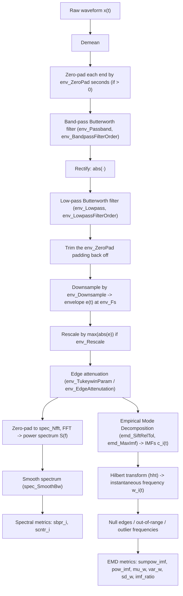

# Technical details

This document explains the math behind every stage of the `envelopeMetrics` pipeline:
extracting a speech amplitude envelope, characterizing its rhythm via its power spectrum,
and characterizing its rhythm via Empirical Mode Decomposition (EMD) and the
Hilbert–Huang Transform (HHT). For a quick-start guide to using the code, see
[README.md](README.md). Everything below is implemented in
[envelopeMetrics.m](envelopeMetrics.m), and every figure here is generated by
[demo.m](demo.m) from [data/example1.wav](data/example1.wav) — run `demo.m` to regenerate them.

## Notation

| Symbol | Meaning |
|---|---|
| $x(t)$ | raw waveform |
| $F_s$ | waveform sampling rate (`Fs`) |
| $e(t)$ | amplitude envelope |
| $F_{s,e}$ | envelope sampling rate (`env_Fs` $= F_s /$ `env_Downsample`) |
| $S(f)$ | envelope power spectrum |
| $c_i(t)$ | $i$-th intrinsic mode function (IMF) |
| $\omega_i(t)$ | instantaneous frequency of $c_i(t)$ |
| `prop_Name` | an `envelopeMetrics` object property that controls that step |

## Pipeline overview

The pipeline branches after envelope extraction into two independent characterizations of
envelope rhythm: a **spectral** branch (power spectrum → band metrics) and an **EMD**
branch (intrinsic mode functions → instantaneous-frequency metrics).

## 1. Envelope extraction

Rhythm analyses target a *vocalic energy amplitude envelope* — the slow amplitude
modulation of energy in the vocalic (roughly 400–4000 Hz) frequency band, not the raw
waveform. `extractEnvelopes` computes it as:

$$
e(t) = \mathrm{LP}\Big(\big|\mathrm{BP}(x(t) - \bar{x})\big|\Big)
$$

where $\mathrm{BP}(\cdot)$ is a zero-phase Butterworth band-pass filter (`butter` +
`filtfilt`, order `env_BandpassFilterOrder`, passband `env_Passband`, default 400–4000 Hz)
and $\mathrm{LP}(\cdot)$ is a zero-phase Butterworth low-pass filter (order
`env_LowpassFilterOrder`, cutoff `env_Lowpass`, default 10 Hz). Zero-phase filtering
(`filtfilt`) is used throughout so the envelope's timing isn't shifted relative to the
waveform.

`filtfilt`'s edge transients grow relative to a short token, since both filters need time
to settle. If `env_ZeroPad` (default 0, disabled) is set to a duration in seconds, that
many zeros are appended to each end of $x(t) - \bar{x}$ before $\mathrm{BP}(\cdot)$, carried
through $\mathrm{LP}(\cdot)$, and trimmed back off immediately afterward — so the returned
envelope has the same length and timing as without padding, just with cleaner edges.

The envelope is then downsampled by a factor of `env_Downsample` (default 100), giving it
its own sampling rate $F_{s,e} = F_s /$ `env_Downsample`, and — if `env_Rescale` is
true (the default) — rescaled to a maximum absolute value of 1:

$$
e(t) \leftarrow \frac{e(t)}{\max_t |e(t)|}
$$

*The envelope (orange) tracks the amplitude modulation of the vocalic energy in the
waveform (gray) — one peak per syllable in this example.*

## 2. Edge attenuation

Both the spectral and EMD branches need the envelope's edges to taper toward zero, since
a hard-edged segment of speech otherwise introduces spurious energy at the edges once it's
windowed or decomposed. `attenuateEdges` supports two options:

- **Tukey window** (if `env_TukeywinParam` is set): multiplies $e(t)$ by a Tukey
  (tapered-cosine) window with that shape parameter.
- **Linear ramp** (if `env_EdgeAttenutation` $= t_c$ is set, the default at 0.05 s): a
  window that ramps linearly from 0 to 1 over the first and last $t_c$ seconds:

$$
w(t) = \min\left(\frac{t}{t_c},1\right)\cdot\min\left(\frac{T-t}{t_c},1\right),
\qquad e(t) \leftarrow e(t)\cdot w(t)
$$

where $T$ is the envelope's duration. Both can be combined; either can be disabled by
setting the corresponding property to `nan`.

## 3. Spectral analysis

`extractSpectra` re-centers and rescales the envelope, applies edge attenuation, then
zero-pads it to `spec_Nfft` samples ($N$, default 2048 — must exceed the longest envelope's
sample count) before computing a power spectrum via FFT:

$$
S[k] = \frac{2\big|\mathrm{FFT}(e, N)[k]\big|^2}{N}, \qquad
f_k = \frac{k \cdot F_{s,e}}{N}, \qquad k = 0, \dots, \frac{N}{2}-1
$$

The raw periodogram is then smoothed with a moving-average filter of length
$L = \lfloor N \cdot B / F_{s,e} \rfloor$, where $B$ is `spec_SmoothBw`. To avoid distorting the
edges of the smoothed spectrum, the spectrum is mirrored on both sides before filtering and
the smoothed middle segment is kept:

$$
S_{\text{smooth}} = \mathrm{MovingAvg}_L\big([\mathrm{fliplr}(S)\ \ S\ \ \mathrm{fliplr}(S)]\big)\Big|_{\text{middle third}}
$$

*Two prominent peaks: one around 1.5–2 Hz (supra-syllabic timescale rhythm) and one around 5 Hz
(syllable timescale rhythm), consistent with the three peaks visible in the amplitude envelope.*

## 4. Spectral metrics

Given the smoothed spectrum, `spectralMetrics` computes, for each configured frequency
band:

**Spectral band power ratio** — for power bins `spec_PowerBins` (default
$[1, 3.5)$ and $[3.5, 10)$ Hz), the power in each bin is

$$
P_i = \sum_{f \in \text{bin}_i} S(f)
$$

and the metric `sbpr_i` is the ratio of power in adjacent bins:

$$
\text{sbpr}_i = \frac{P_i}{P_{i+1}}
$$

**Spectral centroid** — for centroid bins `spec_CentroidBins` (default $[1, 10)$ Hz), the
metric `scntr_i` is the power-weighted mean frequency (center of gravity) within that bin:

$$
\text{scntr}_i = \frac{\sum_{f \in \text{bin}_i} S(f) \cdot f}{\sum_{f \in \text{bin}_i} S(f)}
$$

## 5. Empirical Mode Decomposition

Empirical Mode Decomposition adaptively decomposes the (edge-attenuated) envelope into a
small number of oscillatory components — Intrinsic Mode Functions (IMFs) $c_1(t), c_2(t), \dots$
— ordered from fastest to slowest oscillation, via an iterative *sifting* procedure: repeatedly
subtract the mean of the upper and lower envelopes (fit through the signal's local maxima and
minima) until the result meets a stopping criterion, then subtract that IMF from the signal and
repeat for the next one. `getImfs` calls MATLAB's `emd` with:

- `emd_SiftRelTol` (default 0.1) — the relative tolerance that ends sifting for one IMF.
- `emd_MaxImf` (default 3) — the maximum number of IMFs to extract (fewer may be returned
  if sifting terminates early; missing IMFs are padded with `NaN`).
- `emd_SiftMaxIterations`, `emd_MaxNumExtrema`, `emd_MaxEnergyRatio`, `emd_Interpolation` —
  optional pass-throughs to `emd`'s own `SiftMaxIterations`/`MaxNumExtrema`/
  `MaxEnergyRatio`/`Interpolation` options; left at `nan`/`""` (MATLAB's own defaults)
  unless set explicitly.

For speech rhythm, the first IMF typically captures syllable-timescale oscillations, the
second stress/foot-timescale oscillations, and higher-order IMFs progressively slower,
phrase-timescale oscillations.

*The envelope (gray) decomposed into its first two IMFs: IMF1 (orange) oscillates near the
syllable rate, IMF2 (yellow) varies more slowly.*

## 6. Hilbert–Huang instantaneous frequency

Each IMF is (by construction) a narrowband signal, so its Hilbert transform gives a
well-defined analytic signal and instantaneous frequency. MATLAB's `hht` forms the analytic
signal

$$
z_i(t) = c_i(t) + j~\mathcal{H}\{c_i(t)\} = A_i(t)~e^{j\phi_i(t)}
$$

and the instantaneous frequency is the rate of change of the unwrapped phase:

$$
\omega_i(t) = \frac{1}{2\pi}\frac{d\phi_i(t)}{dt}
$$

(`emd_HhtFrequencyLimits` is an optional pass-through to `hht`'s own `FrequencyLimits`
option, left at its default — the full range up to $F_{s,e}/2$ — unless set explicitly.)

Instantaneous frequency is only meaningful where the IMF has non-negligible amplitude, so
`getImfs` nulls out (sets to `NaN`) three kinds of unreliable values:

1. **Edges** — the first/last `emd_EdgeNull` seconds (default 0.1 s) of every IMF, where
   the sifting/Hilbert transform is least reliable.
2. **Out-of-range frequencies** — values outside `emd_ImfFreqBounds`. By default this is
   `[]`, meaning it auto-derives from the envelope's own lowpass filter as the frequency at
   which that filter's magnitude response reaches `emd_AutoImfFreqBoundsDb` (default −10 dB),
   using the closed-form Butterworth magnitude response (independent of $F_s$). With $L$ =
   `env_Lowpass`, $d$ = `emd_AutoImfFreqBoundsDb`, and $n$ = `env_LowpassFilterOrder`,
   `emd_ImfFreqBounds` is
   $\left[0,\ \ L\cdot\big(10^{-d/10}-1\big)^{\frac{1}{2n}}\right]$.
   With the defaults (10 Hz, order 4, −10 dB) this evaluates to $[0, 13.16]$ Hz. Because it's
   derived, it automatically tracks `env_Lowpass`/`env_LowpassFilterOrder` if you change
   them — set `emd_ImfFreqBounds` to an explicit `[low high]` to override it instead.
3. **Extreme outliers** — values above the `emd_FreqExclusionPercentile`-th percentile
   (default 99%), computed across all IMFs and time points together.

*IMF1's instantaneous frequency (solid) rises during each syllable's oscillation; IMF2's
(dashed) stays low and comparatively flat, consistent with it tracking the slower
stress-level rhythm.*

## 7. EMD metrics

For each IMF $i$ (up to `emd_MaxImf`), `emdMetrics` computes, writing $P_i$ for `sumpow_imf`
and $Q_i$ for `pow_imf`:

$$
P_i = \sum_t |c_i(t)|
\qquad\qquad
Q_i = P_i \cdot \frac{F_{s,e}}{N_i}
$$

where $N_i$ is the number of samples in $c_i$ — i.e. $Q_i$ (`pow_imf`) is a power-per-second
rate, independent of the envelope's duration, while $P_i$ (`sumpow_imf`) is not.

$$
M_i = \overline{\omega_i(t)}
\qquad
V_i = \mathrm{Var}\big[\omega_i(t)\big]
\qquad
D_i = \sqrt{V_i}
$$

($M_i$, $V_i$, $D_i$ are returned as `mu_w`, `var_w`, `sd_w` respectively; means/variances
computed ignoring the `NaN`-nulled samples from step 6), reflecting the average rate and the
stability of the rhythm on that IMF's timescale. Finally, adjacent IMFs' power is compared
via:

$$
R_{i+1,i} = \frac{P_{i+1}}{P_i}
$$

($R_{i+1,i}$ is returned as `imf_ratio`.)
